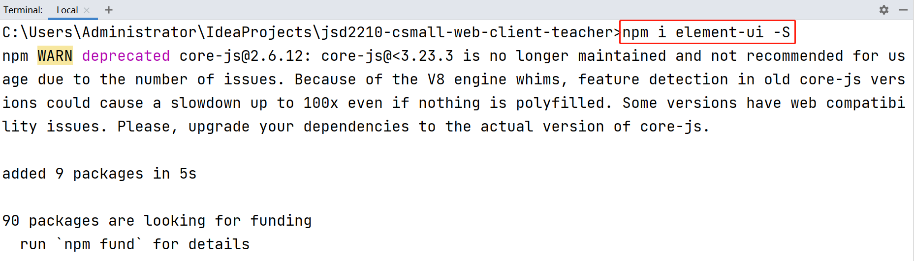

# 关于VUE Cli

VUE Cli即VUE Client，通常称之为“VUE脚手架”。

VUE Cli项目是“单页面”的应用程序，也就是说，在整个项目中，将只有1个HTML页面！在VUE Cli的概念中，页面的显示是由多个不同的“视图组件”共同完成的，并且，其中的任何“视图组件”都是可以随时替换的！

# 关于VUE Cli项目的结构

- `[.idea]`：并不是VUE Cli项目独有的，只要是使用IntelliJ IDEA打开的项目，都有此文件夹，是IntelliJ IDEA管理项目时存储的一些文件，通常不必手动管理，如果此文件夹的内容出错，删除即可，后续IntelliJ IDEA会自动重新创建
- `[node_modules]`：重要，是当前项目中使用的依赖项所在的文件夹，通常不必手动管理，此文件夹及内容通常不会被提交到GITEE或类似的服务器，则从GITEE或类似的服务器下载得到的项目中也没有此文件夹及内容，需要在项目的根目录下执行`npm install`命令，则会自动创建此文件夹并下载所需的依赖项
- `[public]`：存放静态资源的文件夹，例如`.html`、`.css`、`.js`、图片等文件
  - `favicon.ico`：当前网站的图标文件，必须是此文件名
  - `index.html`：当前项目中唯一的HTML页面
- `[src]`：项目的源代码文件夹
  - `[assets]`：静态资源文件夹，通常此文件夹下的内容不会随着程序运行而发生使用的变化
  - `[components]`：存放视图组件的文件夹，此处的视图组件通常并不配置路由，并且，被其它视图组件调用，甚至，可以传入一些参数
  - `[router]`：存放路由配置的文件夹
    - `index.js`：默认的路由配置文件，此文件中的`routes`常量就是当前项目中的路由配置，每个路由对象都描述了URL与视图组件的对应关系
  - `[store]`：存放公共数据的文件夹
    - `index.js`：默认的存放公共数据的文件
  - `[views]`：存放视图组件的文件夹
  - `App.vue`：是默认被注入到`index.html`中的视图文件
  - `main.js`：程序的主配置文件，例如安装了新的软件，则需要在此文件中添加配置
- `.gitignore`：配置需要被GIT忽略的文件或文件夹，例如VUE Cli项目中的`node_modules`文件夹、Java项目中的`target`文件夹等
- `babel.config.js`：Babel的配置文件，通常不必手动管理

- `jsconfig.json`：JavaScript的相关配置，通常不必手动管理
- `LICENSE`：通常在GIT仓库将项目设置为开源时，需要添加此文件
- `package.json`：项目的配置文件，类似Maven项目中的`pom.xml`，主要配置了当前项目的依赖项、执行的相关脚本
- `package-lock.json`：临时使用的锁定的`package.json`的衍生版本配置文件，通常不必手动管理，并且，也不建议手动管理，当源代码发生变化时，可能随时根据新的源代码再次生成此文件
- `README.md`：建议使用的项目说明文档，你应该在此文档中对项目进行基本的说明，例如这是一个什么样的项目，如何安装，如何准备运行环境，如果启动此项目等
- `vue.config.js`：Vue的配置文件，通常不必手动管理

# 关于`<router-view/>`

在设计视图时，可以按需添加`<router-view/>`标签，每个视图中最多只允许存在1个此标签。

此标签的作用表示“当前位置将由其它的视图组件来完成显示”，具体由哪个组件显示，是根据URL来决定的！

# 关于视图组件

视图组件表现为以`.vue`作为扩展名的文件，通常存放于`src/views`文件夹下。

视图组件的源代码由3大部分组成：

- `<template>`标签：用于实现页面内容的设计，注意：此标签的直接子标签最多只允许存在1个
- `<style>`标签：可选的，用于设计CSS样式
- `<script>`标签：可选的，用于设计JavaScript程序

# 安装Element UI

在终端窗口中，在当前项目的根目录下，执行`npm i element-ui -S`命令，即可安装Element UI，例如：



完成后，还需要在`main.js`中添加配置：

```javascript
import ElementUI from 'element-ui';
import 'element-ui/lib/theme-chalk/index.css';

Vue.use(ElementUI);
```

完成后，在此项目中的任何视图组件中可以直接编写基于Element UI的代码。


