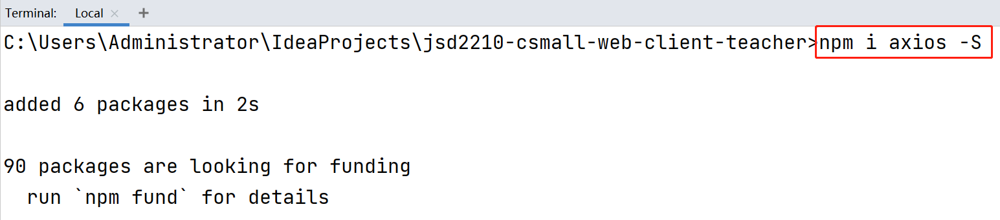
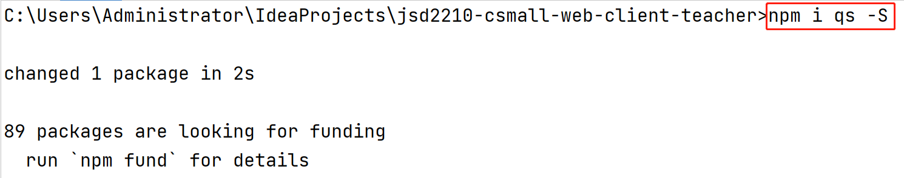

# 嵌套路由

当在`App.vue`中使用了`<router-view/>`后，表示`App.vue`中对应的区域将由某个其它视图来显示，具体由哪个视图来显示，取决于当前访问的URL，根据此URL在`router/index.js`中找到匹配的视图组件！


在当前的设计中，`App.vue`交由`HomeView.vue`来完成显示，但是，`HomeView.vue`也并没有完成全部内容的显示，而是也使用了`<router-view/>`，则出现了`<router-view/>`的嵌套。

如果需要某个视图显示在子级的`<router-view/>`中，则其路由必须配置在对应的父级的`children`属性（此属性的配置与`routes`完全相同）中！

简单来说，如果将路由配置在`routes`下，则此视图显示在`App.vue`的`<router-view/>`位置，如果将路由配置在`HomeView`的路由的`children`下，则此视图显示在`HomeView.vue`的`<router-view/>`位置。


# 安装axios

在终端窗口中，在当前项目文件夹下，安装axios：



安装成功后，还需要在`main.js`中添加配置：

```javascript
import axios from 'axios';

Vue.prototype.axios = axios;
```


# 关于CORS（跨域访问）

跨域：客户端与服务器端并不在同一个域（同一个域：主机相同，端口相同）。

在默认情况下，不允许向某服务器端提交异步的跨域访问请求。

在FireFox浏览器，禁止跨域访问时的错误表现为：

```
已拦截跨源请求：同源策略禁止读取位于 http://localhost:9080/albums/add-new 的远程资源。（原因：CORS 头缺少 'Access-Control-Allow-Origin'）。状态码：200。
```

在Chrome浏览器，禁止跨域访问时的错误表现为：

```
Access to XMLHttpRequest at 'http://localhost:9080/albums/add-new' from origin 'http://localhost:9000' has been blocked by CORS policy: No 'Access-Control-Allow-Origin' header is present on the requested resource.
```

可以在服务器端进行配置，允许跨域访问！例如，在服务器端项目的根包下，创建`config.WebMvcConfiguration`类，实现`WebMvcConfigurer`接口，并重写其中的`addCorsMappings()`方法：

```java
package cn.tedu.csmall.product.config;

import lombok.extern.slf4j.Slf4j;
import org.springframework.context.annotation.Configuration;
import org.springframework.web.servlet.config.annotation.CorsRegistry;
import org.springframework.web.servlet.config.annotation.WebMvcConfigurer;

@Slf4j
@Configuration
public class WebMvcConfiguration implements WebMvcConfigurer {

    @Override
    public void addCorsMappings(CorsRegistry registry) {
        registry.addMapping("/**")
                .allowedHeaders("*")
                .allowedMethods("*")
                .allowedOriginPatterns("*")
                .allowCredentials(true)
                .maxAge(3600);
    }

}
```

# 关于`@RequestBody`

客户端向服务器端提交请求时，请求参数可以是对象格式的，例如：

```json
ruleForm: {
    name: '测试数据001',
    description: '测试数据的简介001',
    sort: '99'
}
```

或者，也可以是FormData格式的，例如：

```
name=测试数据001&description=测试数据的简介001&sort=99
```

当服务器端接收请求参数时，没有使用`@RequestBody`时，客户端提交的请求参数**必须**是FormData格式的，否则，服务器端接收到的各请求参数值均为`null`。

当服务器端接收请求参数时，使用了`@RequestBody`时，客户端提交的请求参数**必须**是对象格式的，否则，服务器端的控制台将提示警告：

```
2023-02-28 11:54:13.101  WARN 16804 --- [nio-9080-exec-2] .w.s.m.s.DefaultHandlerExceptionResolver : Resolved [org.springframework.web.HttpMediaTypeNotSupportedException: Content type 'application/x-www-form-urlencoded;charset=UTF-8' not supported]
```

另外，当使用了`@RequestBody`后，在Knife4j的API文档的调试界面，不再提供各请求参数的输入框，而是改为通过编辑一段JSON数据来调整请求参数。

# 关于`qs`

`qs`是前端技术中，可以便捷的将对象转换成FormData格式数据的工具。

首先，需要安装`qs`：



然后，在`main.js`中添加配置：

```java
import qs from 'qs';

Vue.prototype.qs = qs;
```

完成后，在任何代码位置，都可以实现将对象转换成FormData格式的字符串，例如：

```javascript
let formData = this.qs.stringify(this.ruleForm);
```


